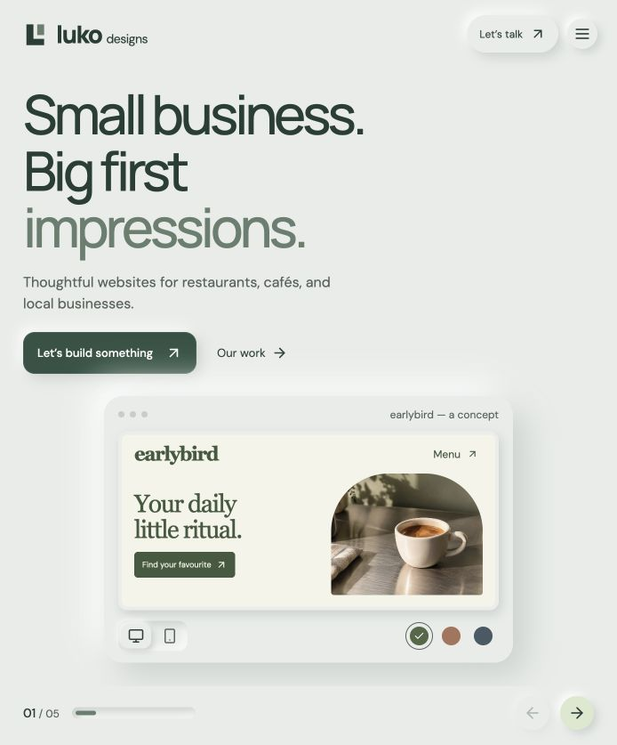
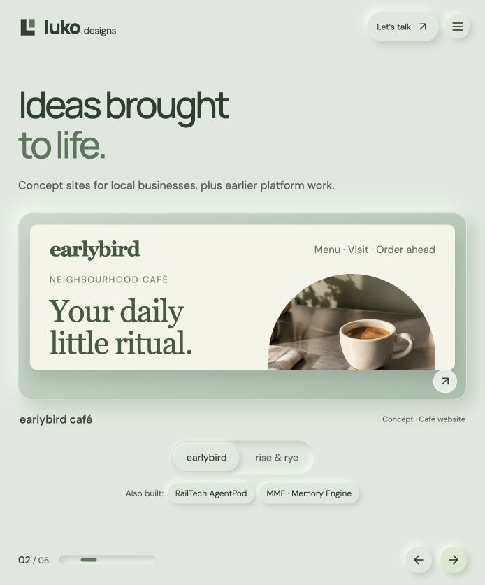
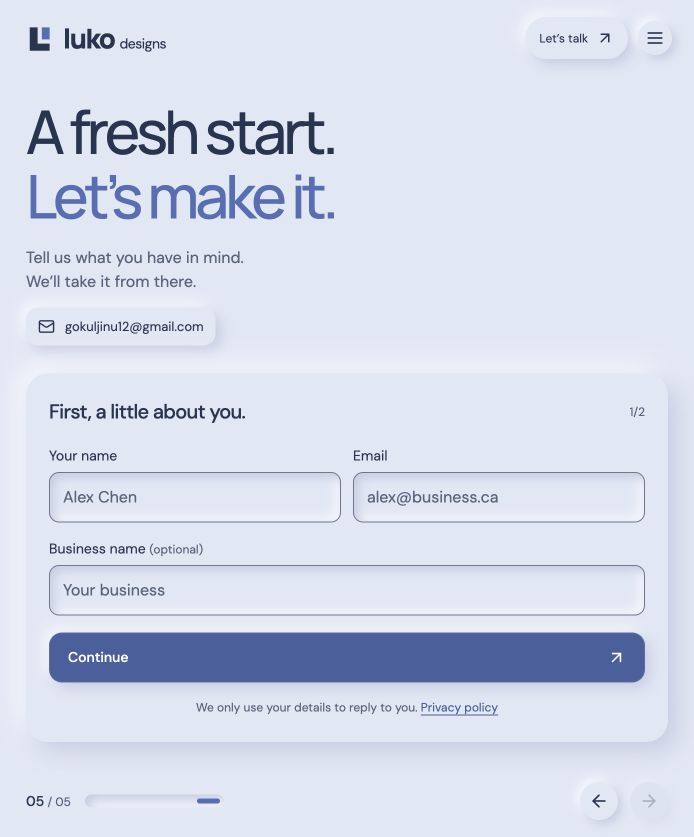

# Luko Designs

The website for Luko Designs, an independent web design studio in Toronto. A single-page React + Vite site, hosted as static files on Vercel. Enquiries are sent by email through [Web3Forms](https://web3forms.com), with no server or database.

## Live site

[Visit Luko Designs](https://webagency-mu.vercel.app/)

## Screenshots

Captured from the live site on September 16, 2026.

### Homepage

The opening section introduces the studio with an interactive café preview, device controls, and colour palettes.



### Work showcase

Concept websites for local businesses sit alongside links to earlier platform projects.



### Contact

A two-step enquiry form collects contact details before asking about the project.



## Run locally

```sh
npm ci
cp .env.example .env   # then fill in the values
npm run dev            # http://localhost:5173
```

`npm run build` outputs the site to `dist/`, and `npm run preview` serves that build locally.

## Settings (`.env` locally, Vercel → Settings → Environment Variables in production)

| Variable | What it does |
| --- | --- |
| `VITE_WEB3FORMS_KEY` | Access key from web3forms.com, created with the email that should receive enquiries. Without it, the form tells visitors to email directly and nothing is sent. |
| `VITE_BOOKING_URL` | Optional Cal.com / Calendly link. The "Book a call" button only appears when this is set. |

Both values end up in the public site, and that's expected. Web3Forms keys are designed for browser use. Rebuild or redeploy after changing them.

## Deploy to Vercel

1. Import the GitHub repo in Vercel. It detects Vite automatically (build `npm run build`, output `dist`).
2. Add the environment variables above.
3. Enable **Web Analytics** in the Vercel project (cookieless, already wired up in `src/main.jsx`).
4. Add your domain, then update `lukodesigns.ca` in `index.html`, `public/robots.txt`, `public/sitemap.xml`, and `public/privacy.html`.

`vercel.json` sets security headers, including a Content Security Policy that only allows requests to this site and `api.web3forms.com`. If you add a third-party script or embed, allow its domain there.

## Where things live

- **Copy, projects, FAQ, form logic:** `src/main.jsx` (contact email in `CONTACT_EMAIL` at the top)
- **Design and breakpoints:** `src/style.css`
- **Privacy policy:** `public/privacy.html`
- **Share preview image and icons:** `public/og-image.png`, `public/apple-touch-icon.png`, `public/favicon.svg`

## Site behaviour

Five horizontal sections use native scroll snapping. Wheel, trackpad, swipe, the arrow keys, and the header/footer controls all navigate, and the URL hash (`#work`, `#contact`, …) follows the current section so links can point straight at one. When a section's content is taller than the screen (small laptops, zoomed text, phones in landscape), the section scrolls vertically first and only moves on once it reaches the end. Inactive sections are inert, and focus moves to the new section's heading. Motion respects reduced-motion preferences.

## Content notes

- **earlybird café** and **rise & rye bakery** are self-initiated concepts, labelled as such on the site. The bakery image slot is marked `FILL IN WITH PROPER IMAGE` in `src/main.jsx`.
- **RailTech AgentPod** and **MME** are Gokul's personal portfolio projects that predate Luko Designs, not client commissions.
- The FAQ answers are drafts. Check they match how you actually work.
